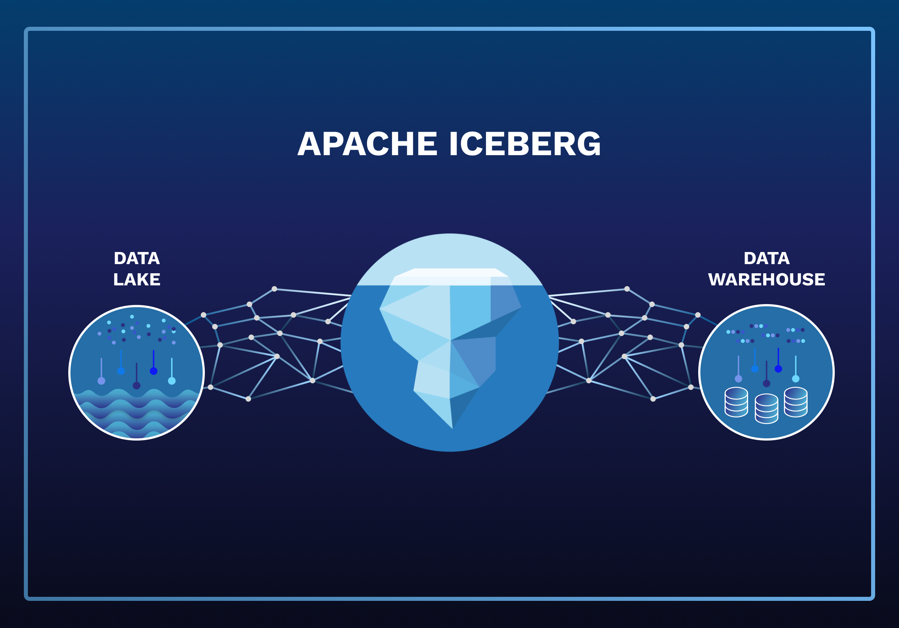

# 📘 Документация по развёртыванию MinIO + Spark + Iceberg + Jupyter и загрузке ZIP-архивов в Iceberg

---

---

## 🔧 1. Создание структуры директорий (в WSL2)

```bash
mkdir -p ~/msij-project/{conf,compose/docker/{spark,jupyter},minio,work/{scripts,notebooks}}
cd ~/msij-project
```

### 📂 Описание директорий

* **conf/**
  Конфигурационные файлы проекта (например, `spark-defaults.conf`).

* **compose/**
  Файлы для Docker Compose и кастомных образов.

  * **docker/spark/** — Dockerfile и зависимости (JAR'ы) для Spark.
  * **docker/jupyter/** — Dockerfile и конфиги для Jupyter.

> ℹ️ **Важно:** образ Jupyter создаётся из того же базового образа, что и Spark (используется одна и та же версия Spark).

* **minio/**
  Данные MinIO — локальное хранилище, где создаются S3-бакеты для Iceberg.

* **work/**
  Рабочая директория проекта.

  * **scripts/** — Python-скрипты для ETL/обработки данных.
  * **notebooks/** — Jupyter-ноутбуки для анализа и отладки.

---

### 🌳 Структура директорий (`tree`)

```text
msij-project/
├── conf/                     # Конфиги Spark, MinIO и окружения
│   └── spark-defaults.conf
│
├── compose/                  # Docker Compose и кастомные образы
│   ├── docker/
│   │   ├── spark/            # Dockerfile для Spark
│   │   │   └── Dockerfile
│   │   └── jupyter/          # Dockerfile для Jupyter
│   │       └── Dockerfile
│   ├── docker-compose.yml    # Основной файл запуска
│   └── requirements.txt      # Файл с зависимостями
│
├── minio/                    # Локальное хранилище MinIO (бакеты)
│
└── work/                     # Рабочие материалы проекта
    ├── scripts/              # Python-скрипты
    │   └── zip_to_iceberg_raw.py
    │
    └── notebooks/            # Jupyter-ноутбуки
        ├── etl_experiments.ipynb
        ├── iceberg_queries.ipynb
        └── ...
```

---

## 🐳 2. Docker Compose архитектура (MinIO, Spark, Iceberg REST, PostgreSQL, Jupyter) - обновление (ноябрь 2025)

**Файл:** [`docker-compose.yml`](./compose/docker-compose.yml)

```yaml
services:
  minio:
    image: minio/minio
    ...
  mc:
    image: minio/mc
    depends_on:
      minio:
        condition: service_healthy
    ...
  spark-master:
    build: ./docker/spark
    image: local/spark-rest:3.5.0-aws34-ice161-rest160
    depends_on:
      minio:
        condition: service_healthy
      mc:
        condition: service_started
    ...
  spark-worker:
    image: local/spark-rest:3.5.0-aws34-ice161-rest160
    depends_on:
      spark-master:
        condition: service_started
    ...
  jupyter:
    build: ./docker/jupyter
    image: local/jupyter-spark-rest:3.5.0-aws34-ice161-rest160
    depends_on:
      spark-master:
        condition: service_started
    ...
  iceberg-rest:
    image: tabulario/iceberg-rest:1.6.0
    depends_on:
      postgresql:
        condition: service_healthy
      spark-master:
        condition: service_started
    ...
  postgresql:
    image: postgres:15-alpine
    ...
volumes:
  spark-logs:
  minio-data:
  pg_iceberg_data:
```

---

### 🧩 Описание сервисов

* **minio** — объектное S3-хранилище, используется Iceberg и Spark для хранения данных (`s3a://warehouse/iceberg/`).
* **mc** — утилита MinIO, автоматически создаёт бакеты (`raw`, `stage`, `warehouse`) при запуске кластера.
* **spark-master** — управляющий узел Spark-кластера (Spark 3.5.0 + Iceberg + AWS SDK v2 + GraphFrames).
  Поддерживает подключение Iceberg REST и чтение/запись в MinIO.
* **spark-worker** — рабочий узел Spark, использует тот же образ, что и мастер.
  Выполняет вычисления и операции с Iceberg-таблицами.
* **iceberg-rest** — сервис REST-каталога Apache Iceberg 1.6.1,
  обеспечивает REST API для Spark и PyIceberg. Метаданные хранятся в PostgreSQL.
* **postgresql** — метахранилище Iceberg Catalog (JDBC backend).
  Создаётся база данных `iceberg_catalog` с пользователем `iceberg`.
* **jupyter** — JupyterLab с предустановленным PySpark, PyIceberg, GraphFrames и S3-драйверами.
  Использует `requirements.txt` для установки библиотек Python. Подключается к Spark по `spark://spark-master:7077`.

---

📌 Все сервисы работают в общей сети `spark_network`.
Хранилища данных (`minio-data`, `pg_iceberg_data`, `spark-logs`) монтируются в контейнеры для удобства локальной разработки и анализа.
Spark и Jupyter теперь полностью интегрированы с **Iceberg REST Catalog** и **GraphFrames**, что позволяет выполнять не только табличную, но и графовую аналитику на одних и тех же данных.

---

### 🔄 Обновления проекта (ноябрь 2025)

**📦 Пересобранные образы:**

* Обновлены образы `spark-master`, `spark-worker` и `jupyter` — теперь они содержат зависимости для **Iceberg REST Catalog** и **GraphFrames**.
* В образы добавлены актуальные JAR-файлы:

  * `iceberg-spark-runtime-3.5_2.12-1.6.1.jar`
  * `graphframes-spark3_2.12-0.9.0-spark3.5.jar`
  * AWS SDK v2 (`bundle`, `s3`, `url-connection-client`)

**🗄 Добавлен сервис PostgreSQL:**

* Новый контейнер `postgresql` используется как **JDBC-метахранилище** для Iceberg REST Catalog.
* `iceberg-rest` теперь подключается к PostgreSQL по адресу
  `jdbc:postgresql://postgresql:5432/iceberg_catalog`.

**🧩 Файл `requirements.txt`:**

* Добавлен в папку `compose/` и используется в Dockerfile для установки Python-зависимостей.
* Содержит актуальные версии библиотек для Spark 3.5 и Iceberg 1.6:

  ```
  pandas==2.3.2
  pyarrow==21.0.0
  fastparquet==2024.5.0
  openpyxl==3.1.5
  pyiceberg==0.5.1
  pyspark==3.5.0
  graphframes-py==0.10.0
  boto3==1.35.63
  ```

**🧠 GraphFrames:**

* Поддержка графовых вычислений активирована через Python-пакет `graphframes-py` и соответствующий JAR.
* Теперь доступны функции `GraphFrame(v, e)`, `inDegrees`, `shortestPaths` и др. внутри Jupyter-ноутбуков.

---
## ⚙️ 3. Конфигурация Spark - обновление (ноябрь 2025)

**Файл:** [`spark-defaults.conf`](./conf/spark/spark-defaults.conf)

```conf
###############################################
# Spark Defaults Configuration
# Упрощённый и оптимизированный вариант
###############################################

# === Кластер ===
spark.master                              spark://spark-master:7077
spark.driver.bindAddress                  0.0.0.0
spark.driver.host                         jupyter

# === S3A / MinIO ===
spark.hadoop.fs.s3a.endpoint              http://minio:9000
spark.hadoop.fs.s3a.path.style.access     true
spark.hadoop.fs.s3a.connection.ssl.enabled false
spark.hadoop.fs.s3a.impl                  org.apache.hadoop.fs.s3a.S3AFileSystem
spark.hadoop.fs.s3a.access.key            minio
spark.hadoop.fs.s3a.secret.key            minio_minio

##########################################################
# === Iceberg Catalogs ===
# Вариант 1 (Hadoop) — отключён по умолчанию
##########################################################
# spark.sql.extensions                      org.apache.iceberg.spark.extensions.IcebergSparkSessionExtensions
# spark.sql.catalog.ice                     org.apache.iceberg.spark.SparkCatalog
# spark.sql.catalog.ice.type                hadoop
# spark.sql.catalog.ice.warehouse           s3a://warehouse/iceberg/
# spark.sql.defaultCatalog                  ice

##########################################################
# Вариант 2 (REST) — активный
##########################################################
spark.sql.extensions                        org.apache.iceberg.spark.extensions.IcebergSparkSessionExtensions
spark.sql.catalog.ice                       org.apache.iceberg.spark.SparkCatalog
spark.sql.catalog.ice.type                  rest
spark.sql.catalog.ice.uri                   http://iceberg-rest:8181
spark.sql.catalog.ice.warehouse             s3a://warehouse/iceberg/
spark.sql.catalog.ice.io-impl               org.apache.iceberg.aws.s3.S3FileIO
spark.sql.catalog.ice.s3.endpoint           http://minio:9000
spark.sql.catalog.ice.s3.path-style-access  true
spark.sql.catalog.ice.s3.region             us-east-1
spark.sql.catalog.ice.s3.access-key-id      minio
spark.sql.catalog.ice.s3.secret-access-key  minio_minio
spark.sql.defaultCatalog                    ice

# === Ресурсы и производительность ===
spark.serializer                            org.apache.spark.serializer.KryoSerializer
spark.sql.shuffle.partitions                48
spark.executor.instances                    1
spark.executor.cores                        1
spark.executor.memory                       2g
spark.driver.memory                         3g
spark.cores.max                             1
spark.dynamicAllocation.enabled             false

# === Прочее ===
spark.driver.extraJavaOptions               -Duser.name=spark
spark.executor.extraJavaOptions             -Duser.name=spark

```
---

### 📘 Назначение файла [`spark-defaults.conf`](./conf/spark/spark-defaults.conf)

Файл `spark-defaults.conf` содержит ключевые параметры настройки Spark, применяемые по умолчанию при запуске сессий как в Jupyter, так и из CLI. Он нужен для:

* централизованной настройки подключения к MinIO (через `s3a`)
* определения каталога Iceberg (через `spark.sql.catalog.*`)
* задания схемы вычислительных ресурсов (executors, memory, cores)
* настройки сериализации, шардирования, отладки

Этот файл монтируется в каждый контейнер, где используется Spark (`master`, `worker`, `jupyter`), что гарантирует единообразие поведения и конфигурации во всём кластере.

---
### 📦 Docker Hub: [glazole/spark-stack](https://hub.docker.com/r/glazole/spark-stack)
---

### ⚙️ Комментарии к параметрам

#### 🔗 Подключение к MinIO

* `spark.hadoop.fs.s3a.endpoint` — указывает на адрес MinIO внутри docker-сети.
* `spark.hadoop.fs.s3a.access.key` и `secret.key` — логин/пароль доступа.
* `path.style.access = true` — обязательно для MinIO (работа в режиме "path-style").
* `connection.ssl.enabled = false` — отключаем HTTPS, т.к. работаем локально.

#### 📦 Подключение Iceberg-каталога

* `ice.warehouse = s3a://warehouse/iceberg/` — каталог, где Iceberg будет хранить метаданные и данные таблиц.
* `defaultCatalog = ice` — позволяет обращаться к таблицам как `ice.db.table`.

#### ⚡ Производительность и ресурсы

Spark по умолчанию запускает **одного исполнителя (executor)** на **одном ядре** и с **2 ГБ оперативной памяти**. Это подходит для отладки, но при работе с большими архивами может быть узким местом.

Параметры:

| Параметр                       | Значение | Описание                                                            |
| ------------------------------ | -------- | ------------------------------------------------------------------- |
| `spark.executor.instances`     | `1`      | Количество исполнителей (processes) на приложение                   |
| `spark.executor.cores`         | `1`      | Количество ядер на одного исполнителя                               |
| `spark.executor.memory`        | `2g`     | Оперативная память для одного исполнителя                           |
| `spark.driver.memory`          | `3g`     | Память для управляющего процесса (драйвера)                         |
| `spark.sql.shuffle.partitions` | `48`     | Количество партиций при операциях shuffle (например, join, groupBy) |

> ⚠️ **Важно:** Spark обрабатывает данные в оперативной памяти. Если данные слишком большие для памяти executor’а, может происходить сброс на диск или аварийное завершение.

> 📘 **Executor ≠ Worker:**
> Один **executor** — это отдельный JVM-процесс, который выполняет задачи Spark-приложения.
> Один **worker** — это узел (или контейнер), на котором могут запускаться **один или несколько executor’ов**.
> В текущей конфигурации (1 worker + 1 executor) всё исполняется на одном узле, но при масштабировании можно запускать несколько executor’ов на разных (или том же) worker’ах — в зависимости от ресурсов.

---

### 🧠 Как связаны worker, executor, core и task

```text
        Spark Cluster (на Docker или физическом кластере)
        ┌────────────────────┐
        │                    │
        │  Spark Master      │
        │                    │
        └────────────────────┘
                   │
        ┌──────────┴────────────┐
        │                       │
┌─────────────────┐   ┌─────────────────┐
│  Spark Worker 1 │   │  Spark Worker 2 │
└─────────────────┘   └─────────────────┘
        │                       │
        │                       └───┐
        │                           │
┌────────────┐              ┌────────────┐
│  Executor  │              │  Executor  │     (по 1 на worker)
├────────────┤              ├────────────┤
│  Core 1    │              │  Core 1    │
│  ─ Task A  │              │  ─ Task C  │
│  Core 2    │              │  Core 2    │
│  ─ Task B  │              │  ─ Task D  │
└────────────┘              └────────────┘
```

🧩 Расшифровка:

* **Worker** — это узел кластера, который может запускать несколько executor’ов.
* **Executor** — JVM-процесс, выделенный для одного приложения (например, текущего загрузочного скрипта).
* **Core** — логическое ядро, выделенное executor’у.
* **Task** — минимальная единица работы в Spark (например, обработка одного partition).

> 💡 В текущей конфигурации `executor.instances = 1`, `executor.cores = 1`, и один worker — значит, означает, что запускает одну JVM с одним потоком выполнения.

---

📘 При масштабировании:

* можно запускать несколько worker’ов на разных машинах (или контейнерах),
* или запускать нескольких executor’ов на одном worker’е — если хватает ресурсов.

---

### 🔧 Рекомендации по подбору ресурсов

* Для начальной конфигурации можно использовать `4 cores` и `4 GB` памяти на одного исполнителя.
* Если запуск идёт на одной машине с несколькими worker’ами, общее потребление ресурсов будет:
  `num_workers × executor.memory + driver.memory`.
* Например: 3 воркера × 4гб + 3гб драйвер = **\~15 ГБ RAM**.

> 💡 Следите за тем, чтобы при больших `groupBy`, `join`, `distinct` не происходило **гигантского `shuffle`** (перераспределения данных между executor’ами) — это одна из главных причин падения Spark-процессов при ограниченной памяти.

### 🔁 Shuffle — перераспределение данных между исполнителями

**Shuffle** — это процесс, при котором Spark **переносит данные между executor’ами**, чтобы корректно выполнить операции, требующие группировки или объединения данных, хранящихся в разных partition.

Иными словами: если данные для одной группы (`groupBy`) или строки совпадения (`join`) находятся в разных частях датафрейма — их нужно **переместить в одно место**, а значит, между узлами (или внутри одного — между потоками) запускается shuffle.

---

### 🔥 Операции, вызывающие shuffle:

- `groupBy`, `groupByKey`, `reduceByKey`
- `join`, `cogroup`, `distinct`
- `orderBy`, `sort`, `repartition`, `coalesce`

---

### ⚙️ Что происходит при shuffle:

- Spark делит данные на **partition’ы**, перемешивает и отправляет другим executor’ам.
- Создаются **промежуточные файлы** на диск (shuffle files).
- Происходит **запись и чтение на диск**, если данных слишком много.
- Это может **перегружать сеть**, **нагружать память** и создавать **узкие места**.

---

### 📉 Потенциальные проблемы:

| Проблема                   | Причина                         |
|---------------------------|---------------------------------|
| Медленная работа           | Слишком много shuffle-операций |
| OutOfMemory                | Недостаток памяти на executor’е |
| Перегрев CPU/IO диска      | Большое количество файлов       |
| "Перекос" (data skew)      | Неравномерное распределение ключей |

---

### 🧪 В текущей реализации:

- Установлено: `spark.sql.shuffle.partitions = 48`
- Это означает: **при каждой shuffle-операции Spark создаёт 48 выходных партиций**, вне зависимости от входного количества.
- `spark.dynamicAllocation.enabled = false` — значит, число executor’ов не увеличивается автоматически при росте объёма данных (из-за ограниченных возможностьей локальной системы)
- Конфигурация подходит для **локальной обработки средних архивов**, но при переходе к большим данным стоит:
  - следить за "перекосом" ключей (`data skew`)
  - пробовать `repartition()` вручную перед тяжёлыми `groupBy`/`join`
  - увеличивать память/cores per executor при необходимости

---

### ✅ Рекомендации

- Не устанавливать `shuffle.partitions` слишком большим (`>1000`) — будет слишком много маленьких файлов и перегрузка I/O.
- Не делать слишком маленьким (`< num cores`) — нарушается параллельность.
- Оптимально: `#shuffle partitions ≈ #executor cores × 2–3`

---

📌 **Вывод:**  
Shuffle — это один из главных факторов, влияющих на производительность Spark. Даже на одной машине (или в Docker) нерациональный shuffle может замедлить всё приложение или привести к аварии. Значение `spark.sql.shuffle.partitions = 48` — разумный компромисс для текущего сценария.

---

📌 **Почему так сделал:**
Файл `spark-defaults.conf` позволяет гибко управлять как ресурсами, так и поведением Spark. Благодаря единообразной конфигурации все компоненты (Jupyter, Spark Master, Worker) используют одинаковые настройки и могут обрабатывать данные из MinIO и писать в Iceberg без дополнительных параметров.

---
## 🚀 4. Запуск проекта и настройка прав на директории

### 🔐 Проблема с правами доступа

Каталог `work/`, куда контейнеры записывают скрипты, временные файлы и данные, при монтировании из WSL или Linux-хоста может принадлежать **root**.  
Однако Spark в Bitnami-контейнерах запускается от пользователя с `uid = 1001`, и не сможет записывать файлы без соответствующих прав.

📉 Это может привести к ошибкам вида:
```text
Permission denied: Failed to create staging directory under /work...
```
И паденю контейнера при запуске.

---

### 🛠 Решение — выдать права пользователю `1001`

Выполните следующие команды перед первым запуском контейнеров:

```bash
sudo chown -R 1001:1001 /data/drug-forecast/work
sudo chmod -R u+rwX,g+rwX /data/drug-forecast/work
```

📘 Объяснение:

* `chown -R 1001:1001` — назначает владельцем папки `work` пользователя Spark внутри контейнера.
* `chmod -R u+rwX,g+rwX` — даёт права на чтение, запись и переход в директории для владельца и группы (без лишнего открытия на `others`).

---

### ✅ Проверка

После изменения прав можно убедиться, что директория принадлежит `1001`:

```bash
ls -ld /home/glazole/first/data/drug-forecast/work
```

Ожидаемый результат:

```text
drwxrwxr-x 5 1001 1001 4096 ... /home/glazole/first/data/drug-forecast/work
```
Или:

```text
drwxrwxr-x 5 1001 docker 4096 ... /home/glazole/first/data/drug-forecast/work
```
---

### 🔄 Перезапуск контейнеров

Если вы уже запускали `docker compose up -d`, необходимо пересоздать контейнеры, чтобы они увидели новые права:

```bash
docker compose up -d --force-recreate spark-master
```

* `--force-recreate` заставляет Docker пересоздать контейнеры даже без изменения образов.
* Можно указать только сервисы `spark`, `jupyter` и т.п., если не требуется трогать `minio`.

---

### 🌐 Проверка UI

После успешного запуска Spark Master UI будет доступен по адресу:

🔗 [http://localhost:8080](http://localhost:8080)

В интерфейсе можно увидеть:

* зарегистрированные воркеры,
* ресурсы (cores, memory),
* запущенные задачи (если были),
* историю приложений (если включено логирование).

---

📌 **Вывод:**
Установка корректных прав на монтируемые директории — обязательный шаг при работе с Docker-контейнерами Spark. Это гарантирует, что скрипты, Jupyter-сессии и Spark-процессы смогут свободно читать и записывать данные.

## 📒 5. Доступ к Jupyter и Spark Web UI

### 📌 JupyterLab: порт `8888`

После запуска проекта Jupyter-сервер будет доступен по адресу:

🔗 [http://localhost:8888](http://localhost:8888)

По умолчанию:

- запускается в контейнере `jupyter`
- использует токен (указан в логах или задаётся через переменную `JUPYTER_TOKEN`)
- содержит предустановленный PySpark-клиент и SparkSession, настроенный на `spark://spark-master:7077`

Если `JUPYTER_TOKEN` был установлен в `docker-compose.yml`, можно зайти без авторизации:

```yaml
environment:
  JUPYTER_TOKEN: "lab" # в текущей реализации
```
---

### 🔥 Spark Web UI для приложений: порт `4040`

Когда вы запускаете Spark-приложение внутри Jupyter (например, через `SparkSession.builder.getOrCreate()`), Spark создаёт локальный **Web UI** для этого приложения на:

🔗 [http://localhost:4040](http://localhost:4040)

Web UI на `4040` показывает:

* DAG и стадии выполнения (`Stages`, `Jobs`)
* текущие и завершённые задачи (`Tasks`)
* используемую память, план выполнения, шардирование
* SQL-запросы (если используется Spark SQL)
* переменные окружения Spark

> ⚠️ Интерфейс на порту `4040` активен **только пока работает Spark-приложение (сессия)**. Если остановить ячейку или завершить сессию — интерфейс будет недоступен.

---

### 🧠 Полезно знать

* При одновременном запуске нескольких Spark-приложений, следующие UI будут на `4041`, `4042` и т.д.
* Если порт `4040` уже занят, Spark выберет первый доступный (`4041+`)
* В Jupyter также можно использовать `%pyspark`, `%%spark`, `%%sql` (если установлены magics) для интерактивной работы

---

📌 **Вывод:**
Jupyter на порту `8888` — основной интерфейс для запуска ETL-скриптов и отладки,
а Web UI на `4040` помогает анализировать производительность Spark-заданий в реальном времени.

## 📌 Этапы проекта: Spark + MinIO (после запуска Spark)

### ✅ Что уже сделано

* [x] **Структура каталогов** организована: данные `raw` → промежуточные `stage` → витрина `warehouse`.
* [x] **MinIO развернут**, созданы бакеты:

  * `raw` – исходные ZIP/CSV,
  * `stage` – промежуточные Parquet,
  * `warehouse` – целевые таблицы Iceberg.
* [x] **Spark Master + Worker** развернуты, доступны через Spark UI (порт 8080 для мастера, 4040 для приложений).
* [x] **Spark ↔ MinIO** подключение через `s3a://` настроено (рабочие креды в `spark-defaults.conf`).

---

### 🚀 Что сделали после запуска Spark

1. **Подключение локальной директории с архивами в Spark-контейнер**

   * В `docker-compose.yml` примонтировали каталог Windows/WSL (`/mnt/e/crpt_2025`) внутрь Spark как `/win_df`.
   * Теперь Spark видит ZIP-файлы внутри контейнера.

## 📦 6. Скрипт загрузки ZIP-архивов в Iceberg

**Файл:** [`zip_to_iceberg_raw.py`](./work/scripts/zip_to_iceberg_raw.py)

### 🔄 Алгоритм:

1. Получаем все ZIP-файлы из `ZIP_DIR` (по умолчанию `/win_df` - директория внутри контейнера проброшенная снаружи)
2. Для каждого ZIP:

   * Извлекается **первый .csv** файл в tmp-папку
   * CSV читается через `spark.read.csv`
   * Если таблицы `bronze.crpt_2025_raw` нет — она создается
   * Данные добавляются (`append`)
   * Фиксируется в лог: `bronze.crpt_load_log`
3. В конце — сводка (сколько обработано / пропущено / с ошибкой)
4. При повторном запуске, сверяется с лог-таблицей, если ранее такой файл не обрабатывался, он поступает в обработку, иначе - остановка.

📌 *Почему так*:

* Учитывается минимальный парсинг и max эффективность — файл читается «потоково» (через `shutil.copyfileobj`)
* Схема CSV не фиксируется, используется `inferSchema`
* Повторная загрузка исключается благодаря `bronze.crpt_load_log`

---

## 🧪 7. Примеры запуска скрипта обработки ZIP-архивов

Скрипт [`zip_to_iceberg_raw.py`](./work/scripts/zip_to_iceberg_raw.py) загружает CSV-файлы из ZIP-архивов и записывает их в таблицу Iceberg, хранящуюся в MinIO (`s3a://warehouse/iceberg/...`).

---

### ▶️ Вариант 1: запуск через `spark-submit` с использованием Spark-кластера

```bash
docker compose exec spark-master \
  spark-submit --master spark://spark-master:7077 \
  /work/zip_to_iceberg_raw.py
```

📘 Здесь Spark-приложение запускается от имени Spark Master (`--master spark://...`), и задачи будут распределены между всеми доступными worker’ами. Это основной путь при использовании полноценного кластера.

---

### ✅ Вариант 2 (используемый в проекте): запуск в локальном режиме с увеличенными ресурсами

```bash
docker compose exec -e PYTHONUNBUFFERED=1 spark-master \
  spark-submit --master local[2] \
  --conf spark.driver.memory=6g \
  --conf spark.executor.memory=6g \
  /work/zip_to_iceberg_raw.py
```

🧩 **Объяснение параметров:**

* `--master local[2]`
  Запускает Spark в **локальном режиме** (без Master/Worker архитектуры), используя **2 потока** на одной машине. Это упрощает запуск и экономит ресурсы при отладке или запуске в одноконтейнерной конфигурации.

* `--conf spark.driver.memory=6g`
  Выделяет **6 ГБ оперативной памяти** для Spark-драйвера (управляющего процесса).

* `--conf spark.executor.memory=6g`
  Выделяет **6 ГБ памяти** для исполнителя (executor), который будет обрабатывать данные.

* `-e PYTHONUNBUFFERED=1`
  Убирает буферизацию вывода Python внутри контейнера → логи сразу видны в консоли. Полезно при отладке.

---

### 🧪 Когда использовать какой вариант?

| Вариант                            | Когда использовать                               |
| ---------------------------------- | ------------------------------------------------ |
| `--master spark://...`             | При использовании полноценного Spark-кластера    |
| `--master local[n]`                | Для локальной отладки или запуска в 1 контейнере |
| `driver.memory`, `executor.memory` | Когда нужны ресурсы для больших архивов          |

---

📌 **Рекомендуемый подход:**
Если обрабатываешь десятки ZIP-архивов с большими CSV-файлами — **лучше использовать локальный режим с увеличенной памятью**, как во втором примере. Это проще, чем запускать отдельные worker’ы, и даёт полный контроль над ресурсами.

---

## 🧠 8. Чтение и проверка таблиц Iceberg в Jupyter

После выполнения загрузки (через `zip_to_iceberg_raw.py`) можно подключиться к Spark из Jupyter и проверить:

- доступность Iceberg-каталога,
- наличие схем и таблиц,
- структуру и содержимое таблицы.

---

### ✅ Подключение к Spark

```python
from pyspark.sql import SparkSession

spark = (
    SparkSession.builder
    .appName("Check Iceberg")
    .getOrCreate()
)
```

> В текущей реализации используется `spark-defaults.conf`, поэтому Spark автоматически подключается к Iceberg-каталогу `ice` (тип: `hadoop`, warehouse: `s3a://warehouse/iceberg/`).

---

### 📚 Проверка доступных баз данных (схем)

```python
spark.catalog.listDatabases()
```

👀 Ожидаемый результат:

```text
[Database(name='bronze', ...), Database(name='default', ...)]
```

---

### 🗃️ Проверка доступных таблиц в схеме `bronze`

```python
spark.catalog.listTables("bronze")
```

👀 Ожидаемый результат:

```text
[Table(name='crpt_2025_raw', tableType='MANAGED', ...),
 Table(name='crpt_load_log', tableType='MANAGED', ...)]
```

---

### 📄 Чтение таблицы по namespace

```python
df = spark.table("ice.bronze.crpt_2025_raw")
df.show(5)
```

Или через SQL:

```python
spark.sql("SELECT * FROM ice.bronze.crpt_2025_raw LIMIT 5").show()
```

---

### 📂 Чтение таблицы по абсолютному пути

```python
df = spark.read.format("iceberg").load("s3a://warehouse/iceberg/bronze/crpt_2025_raw")
df.show(5)
```

📌 **Почему так:**
Spark 3.5 + Iceberg 1.6 поддерживают как форматы `ice.db.table`, так и абсолютные пути через `s3a://...`.
Абсолютный путь особенно полезен при отладке, когда нужно проверить конкретную таблицу или подкаталог, минуя метаданные каталога.

---

## ✅ Проверка структуры хранилища через MinIO Client

```bash
mc alias set localminio http://localhost:9000 minio minio_minio
mc ls localminio/warehouse/iceberg/bronze/
```

Позволяет убедиться, что таблица `crpt_2025_raw` действительно создана на уровне файлов (Parquet + metadata JSON/AVRO + snapshot files).

---

## 📌 Заключение

| Компонент               | Назначение                                                 |
| ----------------------- | ---------------------------------------------------------- |
| WSL2 + Docker           | Локальная разработка с виртуализированным Linux окружением |
| MinIO                   | Обеспечивает S3-интерфейс для Iceberg                      |
| Spark + Iceberg         | ETL-движок и хранение таблиц с версионностью               |
| Jupyter                 | UI для запуска скриптов и отладки                          |
| `zip_to_iceberg_raw.py` | Скрипт загрузки ZIP-архивов в Iceberg таблицу              |

---

📘 **Итог:**
Текущая реализация позволяет загружать архивы в Iceberg-таблицы, а затем проверять их структуру и содержимое как из Jupyter, так и через Spark CLI. Все таблицы сохраняются с версионностью в `s3a://warehouse/iceberg/bronze/...`, что делает систему расширяемой и пригодной для последующего анализа или инкрементальной загрузки.

---
## 📦 Docker Hub: [glazole/spark-stack](https://hub.docker.com/r/glazole/spark-stack)

